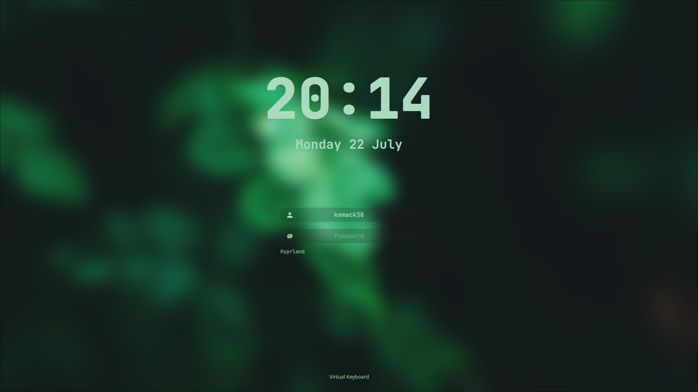

# GreenLeaf login theme for SDDM

A theme for the [SDDM login manager](https://github.com/sddm/sddm).

- Background resolution: 1440p
- Font: JetBrains Mono Nerd Font

### Preview



### Dependencies

- qt6-5compat
- qt6-declarative
- qt6-svg
- sddm
- JetBrains Mono Nerd Font

> qt6-declarative replaces qt6-quickcontrols2
> https://archlinux.org/packages/extra/x86_64/qt6-declarative/


### Install

1. Clone this repository:

   ```sh
   sudo git clone https://github.com/kamack38/sddm-greenleaf-theme.git /usr/share/sddm/themes/greenleaf
   ```

2. Then edit `/etc/sddm.conf`, so that it looks like this:

    ```
    [Theme]
    Current=greenleaf
    ```

Or use the following command

    echo "[Theme]
    Current=greenleaf" | sudo tee /etc/sddm.conf

### Additional information

When editing the theme you can preview it with:

```sh
sddm-greeter-qt6 --test-mode --theme .
```

### Credits

Based on [`Sugar Dark for SDDM`](https://github.com/MarianArlt/sddm-sugar-dark) by [**MarianArlt**](https://github.com/MarianArlt) and [`Astronaut theme`](https://github.com/Keyitdev/sddm-astronaut-theme) by [**Keyitdev**](https://github.com/Keyitdev).

The background is a cropped and resized version of **Prateek Gautam's** [`Green leaf photo on Unsplash`](https://unsplash.com/photos/green-leaf-Qizi-z1AJno).
